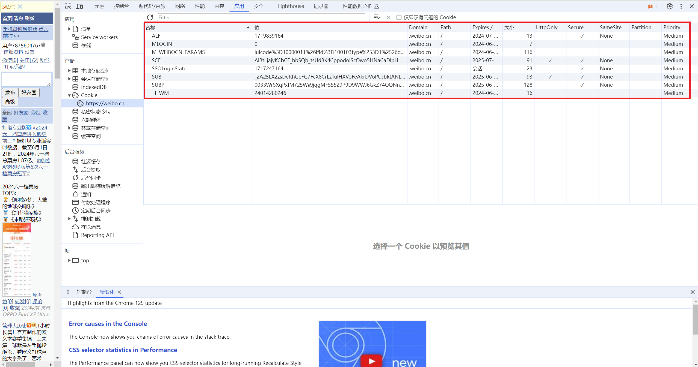
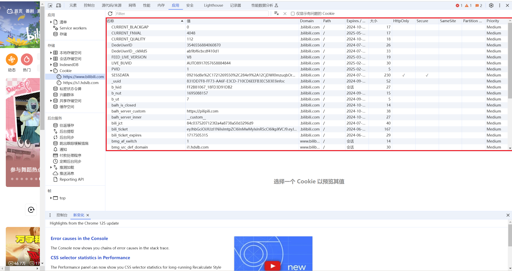

<h1 align='center'>项目申请书</h1><br>
<h4 align='center'>项目名称：bison 爬虫的 cookie 管理与调度系统</h4>
<h4 align='center'>项目主导师：felinae98</h4>
<h4 align='center'>申请人：史浩楠</h4>
<h4 align='center'>邮箱：hxzsty233@gmail.com</h4>

<br>
<br>
<br>

---

<!-- @import "[TOC]" {cmd="toc" depthFrom=1 depthTo=6 orderedList=false} -->

<!-- code_chunk_output -->

- [1. 项目背景：](#1-项目背景)
  - [1.Nonebot Bison](#1nonebot-bison)
    - [相关链接](#相关链接)
  - [2.NoneBot](#2nonebot)
  - [3. cookie](#3-cookie)
    - [1. cookie 是什么](#1-cookie-是什么)
    - [2. cookie 分类](#2-cookie-分类)
    - [3. cookie 使用实例](#3-cookie-使用实例)
  - [4.Python 爬虫](#4python-爬虫)
- [2. 项目详细需求](#2-项目详细需求)
  - [1.调查主流平台的 cookie 使用情况](#1调查主流平台的-cookie-使用情况)
    - [1. Weibo cookie 使用](#1-weibo-cookie-使用)
    - [2. Bilibili cookie 使用](#2-bilibili-cookie-使用)
  - [2.完成通用 cookie 管理组件的开发，分离调度与 cookie 管理部分](#2完成通用-cookie-管理组件的开发分离调度与-cookie-管理部分)
    - [1.完成通用 cookie 管理组件的开发](#1完成通用-cookie-管理组件的开发)
    - [2.分离调度与 cookie 管理部分](#2分离调度与-cookie-管理部分)
  - [3.完成 cookie 管理组件的配置功能](#3完成-cookie-管理组件的配置功能)
- [3. 技术方法及可行性](#3-技术方法及可行性)
  - [1.添加 Weibo 的管理组件](#1添加-weibo-的管理组件)
    - [1.时间调度](#1时间调度)
    - [2. cookie 管理](#2-cookie-管理)
  - [2.cookie 管理组件](#2cookie-管理组件)
  - [3.管理流程示例](#3管理流程示例)
- [4. 规划](#4-规划)
  - [1.项目开发第一阶段（7.01 - 8.15）](#1项目开发第一阶段701---815)
  - [2.项目开发第二阶段（8.15 - 9.30）](#2项目开发第二阶段815---930)
- [5.期望](#5期望)

<!-- /code_chunk_output -->


---
## 1. 项目背景：

### 1.Nonebot Bison

Nonebot Bison 是一款自动爬取各种站点，社交平台更新动态，并将信息推送到社交媒体的机器人。项目使用 Python 语言，并且具有自己独立的前端架构，基于 NoneBot 框架开发。可以独立部署也可以在项目中作为插件使用。Bison 的核心业务是网站数据的获取，因此可以看作多个网站定制化爬虫组成的系统。

#### 相关链接

[项目主页](https://github.com/MountainDash/nonebot-bison)

[开发文档](https://nonebot-bison.netlify.app/)

### 2.NoneBot
[NoneBot](https://nonebot.dev/) 是著名的跨平台 PYTHON 异步机器人框架，可以实现多种自动化信息处理。是 Nonebot Bison 项目的开发框架。

### 3. cookie

#### 1. cookie 是什么

 是浏览网站时由网络服务器创建并由网页浏览器存放在用户计算机或其他设备的小文本文件。网站可以在其中保存用户会话、用户 ID 等信息，可以用于识别用户身份。部分第三方 cookie 可以跟踪用户的浏览记录。目前主流浏览器支持用户查看 cookie，以  为例，在 Chrome 中按  进入开发者模式，在`应用`中可以看到网站的 cookie 信息。

#### 2. cookie 分类

平台的 cookie 使用大概分为匿名和实名两种。匿名 cookie 不需要特别的身份信息，只要模拟匿名用户即可获取网页信息；实名 cookie 则需要验证用户身份，只有满足特定条件的用户才可以获得网页返回的信息。

#### 3. cookie 使用实例

Nonebot Bison 依赖爬虫实现网站信息获取。部分网站依赖用户的 cookie 进行身份识别：新浪微博的“仅粉丝可见”功能，用户向服务器请求资源时，浏览器会将用户本地电脑中的 cookie 文件发送到服务器进行核验，确认身份为 “粉丝” 之后再返回相应内容，否则拒绝请求；Bilibili 的评论区需要确认登录之后才可见，如未登录，将会弹出登录界面，提示 “登陆后可见”。

### 4.Python 爬虫

爬虫是一种基于规则对网址中文本、图片等信息进行自动抓取的程序。爬虫通过模拟真实用户，向服务器发送请求，持续对网页数据进行抓取，直到达成某一条件时停止。

为了模拟真实用户使用，避免被识别，需要提供 http 请求头，Weibo 使用的请求头示例如下：
```python
_HEADER = {
    "accept": (
        "text/html,application/xhtml+xml,application/xml;q=0.9,image/avif,image/webp,image/apng,"
        "*/*;q=0.8,application/signed-exchange;v=b3;q=0.9"
    ),
    "accept-language": "zh-CN,zh;q=0.9",
    "authority": "m.weibo.cn",
    "cache-control": "max-age=0",
    "sec-fetch-dest": "empty",
    "sec-fetch-mode": "same-origin",
    "sec-fetch-site": "same-origin",
    "upgrade-insecure-requests": "1",
    "user-agent": (
        "Mozilla/5.0 (Linux; Android 6.0; Nexus 5 Build/MRA58N) "
        "AppleWebKit/537.36 (KHTML, like Gecko) Chrome/89.0.4389.72 "
        "Mobile Safari/537.36"
    ),
}
```

得益于丰富的生态，Python 成为了主流的爬虫语言，常用的爬虫库有 Requests, BeautifulSoup,  等。爬虫需要遵守网站的 robots 协议，部分网站可能会对爬虫提出频次限制、真人验证等，访问过于频繁可能会被网站封锁 IP，或者遭到账号封禁。因此在编写爬虫时，需要考虑根据网站相关要求设置爬虫抓取频次、使用代理更换 IP 地址、提供 cookie 等信息获取特定网站内容等。

## 2. 项目详细需求

### 1.调查主流平台的 cookie 使用情况

#### 1. Weibo cookie 使用


可以看到，在未登录状态下，微博记录了三条 cookie ，其中就有用于匿名游客访问的 cookie ，在用户登录成功后，网页显示



增加了登录信息的 cookie，这样我的账户信息就存储在 cookie 中了。当我再次访问 weibo.cn 时，可以看到网页保存了会话信息，实现了自动登录。

#### 2. Bilibili cookie 使用

未登录状态下



登录状态下


可以看到添加了用户的 _uuid, Dedeuseid 等 cookie 信息。

### 2.完成通用 cookie 管理组件的开发，分离调度与 cookie 管理部分

#### 1.完成通用 cookie 管理组件的开发

目前 Nonebot Bison 项目没有完善的 cookie 管理部分，需要完成 cookie 管理组件的开发。

目前 Weibo 平台没有完善的 cookie 存储库，需要向用户提供 cookie 接口。在用户输入 cookie 后使用其获取网页信息。


#### 2.分离调度与 cookie 管理部分

项目中的爬虫调度和 cookie 管理是混在一起的，同一由 `SchedulerConfig` 类进行管理，项目要求分离调度与 cookie 管理部分，单独构建 cookie 管理库。

### 3.完成 cookie 管理组件的配置功能

需要定义 `cookie_config` 类，在其中添加cookie 的刷新时间配置、过期时间配置等等。

## 3. 技术方法及可行性

### 1.添加 Weibo 的管理组件

#### 1.时间调度

Weibo 使用的爬虫调度如下：

```python
class WeiboSchedConf(SchedulerConfig):
    name = "weibo.com"
    schedule_type = "interval"
    schedule_setting = {"seconds": 3}
```

该方案设置 python 爬虫请求时间间隔为 3s。可以考虑添加自动化测试脚本来检测 Weibo 允许的时间间隔上限：

```python
import time, requests
 
def test_ip_freq(freq):
    #测试1分钟
    delay = 1 / freq
    t0 = time.time()
    requests_num = 0
    status = "success"
    while True:
        r = requests.get("https://m.weibo.cn/api/container/getIndex?containerid=100103type%3D61%26q%3D%E7%96%AB%E6%83%85%26t%3D0&page_type=searchall&page=2")
        if r.status_code != 200:
            status='fail'
            break
        requests_num += 1
        if time.time() - t0 > 5 * 60:
            break
        time.sleep(delay)
    print(f"当前的访问频率是{freq}/s，状态:{statu},请求总数{s},耗时{requests_num}s, 实际频率{time.time()-t0}")
    return status
for i in range(0.3, 0.55, 0.05):
    status=test_ip_freq(i)
    if status == 'fail':
        break
#统计ip被封的时间
t0 = time.time()
while True:
    r = requests.get("https://m.weibo.cn/api/container/getIndex?containerid=100103type%3D61%26q%3D%E7%96%AB%E6%83%85%26t%3D0&page_type=searchall&page=2")
    if r.status_code == 200:
        break
    time.sleep(10)
print(f"ip被封的时间是{time.time()-t0)}s")
```
由于 Weibo 可以有多个订阅请求，因此考虑将爬虫的目标集群划分不同间隔，按时间间隔进行轮转请求，以减少被封的风险。

#### 2. cookie 管理

可以利用 requests 库实现账户 cookie 自动获取，添加 cookie 过期时间以及刷新失败提醒。参考  的 cookie 管理：

```python
class BilibiliClient:
    _client: AsyncClient
    _refresh_time: datetime
    cookie_expire_time = timedelta(hours=5)

    def __init__(self) -> None:
        self._client = http_client()
        self._refresh_time = datetime(year=2000, month=1, day=1)  # an expired time

    async def _init_session(self):
        res = await self._client.get("https://www.bilibili.com/")
        if res.status_code != 200:
            logger.warning("unable to refresh temp cookie")
        else:
            self._refresh_time = datetime.now()

    async def _refresh_client(self):
        if datetime.now() - self._refresh_time > self.cookie_expire_time:
            await self._init_session()

    async def get_client(self) -> AsyncClient:
        await self._refresh_client()
        return self._client
```
为 Weibo 添加 `cookie_expire_time` 等属性，设置 cookie 更新间隔。

### 2.cookie 管理组件

首先是向用户请求登录名和密码：

```python
import requests
from http import cookiejar

def class cookie:
    def __init__(self):
        self.url = url # 传入网页链接
        self.login_email = login_email
        self.login_code = login_code

    def create_session(self):
        # 创建一个session,作用会自动保存cookie
        self.session = requests.session()
        self.data = {
            'login_email': login_email,
            'login_password': login_password
        }
        self.response = session.post(url = url,data=data)
    
    def login_test(self):
        if self.response != 200:
            return False
        else:
            return True
```
之后可以将 cookie 保存在本地（可选）

得到 cookie 之后可以携带 cookie 进行网页访问：`requests.get(url, cookies = cookies, headers = headers)`

### 3.管理流程示例


## 4. 规划

> 暑假有小学期，但是每天课不多，可以保证每天4小时以上的开发时间

### 1.项目开发第一阶段（7.01 - 8.15）

- [ ] 调查清楚主流平台 cookie 使用情况
- [ ] 进行 cookie 管理组件开发
- [ ] 分离调度与 cookie 管理组件

### 2.项目开发第二阶段（8.15 - 9.30）

- [ ] 尝试前端开发
- [ ] 添加更多平台
- [ ] 编写项目测试，仓库 pr 

## 5.期望

ospp 提供了很好的平台，希望借助这个机会，参与到开源项目中，积累相关经验、学习新的知识，为日后参与更多开源项目提供一个经验借鉴。